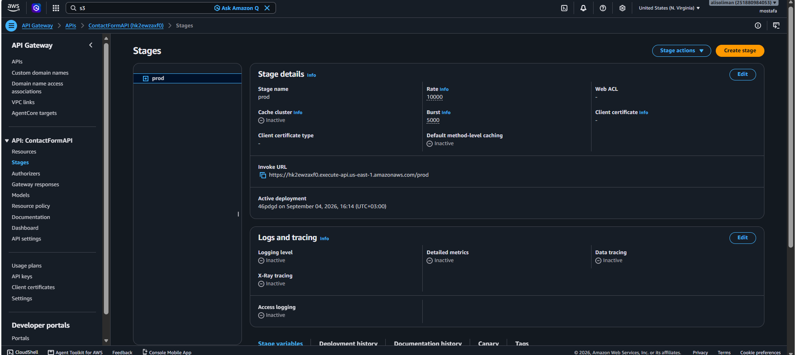
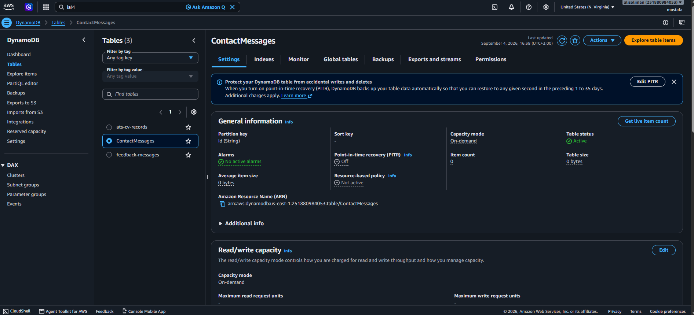
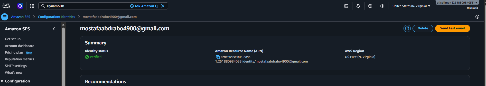
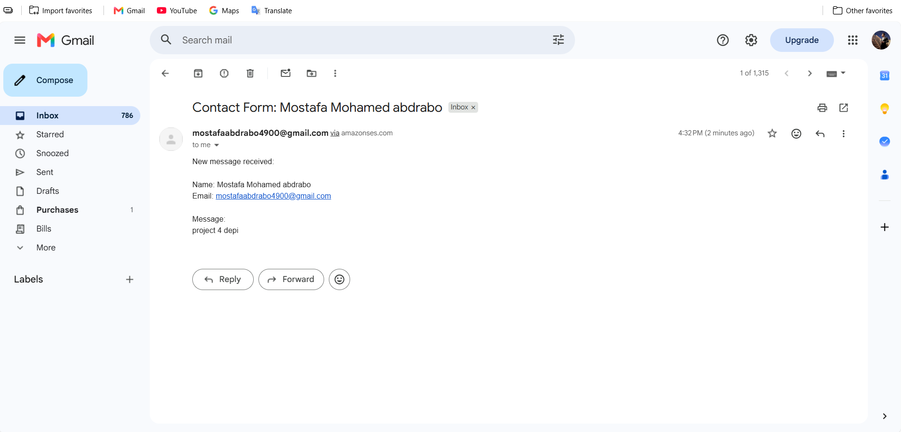
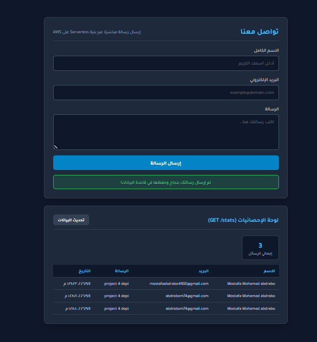

# 💬 Serverless Contact Form


Serverless Contact Form is a cloud-native, fully serverless application for handling user contact/inquiry submissions. It uses S3 for frontend hosting, API Gateway and Lambda for backend processing, DynamoDB for data storage, and Amazon SES for real-time email notifications to the admin.

---

## 📑 Table of Contents
- [Overview](#-overview)
- [Features](#-features)
- [Architecture](#-architecture)
- [AWS Services Used](#-aws-services-used)
- [Project Structure](#-project-structure)
- [Screenshots](#-screenshots)
- [Author](#-author)

---

## 🎯 Overview

This project is a production-ready serverless contact form built entirely on AWS. When a user submits the form, their message is saved to DynamoDB, and an email notification is sent to the admin via Amazon SES — all without managing any servers.

---

## 🚀 Features

- ✅ **Real-time Form Submission:** Responsive UI with dynamic loading state.
- ✅ **Instant Email Alerts:** Automated SES notifications to admin.
- ✅ **NoSQL Persistence:** Reliable storage of submissions in DynamoDB.
- ✅ **Least-Privilege Security:** Fine-grained IAM policies for execution roles.
- ✅ **Monitoring:** CloudWatch Logs for observability.
- ✅ **100% Serverless:** Zero server management and high availability.
- ✅ **Free Tier Friendly:** Cost-optimized architecture.

---

## 📐 Architecture


**Flow:**
1. User submits the form (HTML/JS) hosted on **S3**.
2. Request goes through **API Gateway (REST API)**.
3. **API Gateway** invokes **AWS Lambda**.
4. Lambda saves the submission to **DynamoDB** and forwards the message to **Amazon SES**.
5. **SES** sends an email notification to the admin.
6. **CloudWatch** logs all activity, and **IAM** enforces least-privilege permissions across the stack.

---

## 🛠️ AWS Services Used

| Service | Role | Free Tier Limit |
| :--- | :--- | :--- |
| **Amazon S3** | Hosts static frontend files | 5GB storage |
| **Amazon API Gateway** | REST API endpoints | 1M requests/month |
| **AWS Lambda** | Backend business logic | 1M requests/month |
| **Amazon DynamoDB** | Stores all submitted messages | 25GB storage |
| **Amazon SES** | Sends email notifications | 62,000 emails/month |
| **Amazon CloudWatch** | Logs & monitoring | 5GB logs |
| **AWS IAM** | Granular execution permissions | Always Free |

---

## 📁 Project Structure

```text
├── frontend/
│   ├── index.html       # Web form interface
│   ├── style.css        # Responsive design & styles
│   └── script.js        # API integration & dynamic JS
├── lambda/
│   └── lambda.py        # Python backend script
├── images/               # Architecture diagram & screenshots
```

---

## 📸 Screenshots & Project Proofs

### 1. User Interface

*Responsive contact form with dynamic loading state.*

### 2. API Gateway

*API Gateway REST endpoint configuration.*

### 3. DynamoDB Storage

*Submitted messages stored in DynamoDB.*

### 4. Amazon SES

*SES verified identity used for sending notifications.*

### 5. Email Notification

*Instant email alert received by the admin.*

### 6. Submission Result

*Success response shown to the user after submitting the form.*

---

## 👨‍💻 Author

**Mostafa Mohamed Abdrabo**

[](https://www.linkedin.com/in/mostafa-m-abdrabo/)
[](https://github.com/mostafaabdrabo2022)
[](mailto:mostafaabdrabo4900@gmail.com)

---
